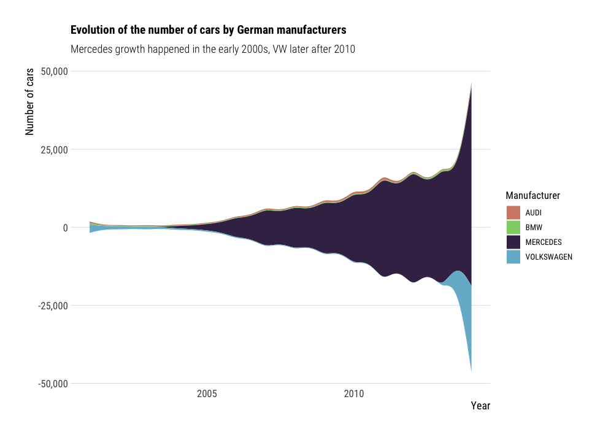

# Dataviz examples in R

Data visualization examples, using the R programming language and
ggplot2 library, mostly.

The dataset used to draw the figures is about CO2 emissions of
driving cars sold in France, and is [publicly available here](https://public.opendatasoft.com/explore/dataset/vehicules-commercialises/table/?flg=fr&sort=puissance_maximale).

The figures are located in the [figures](./figures/) folder, and
the corresponding code in the [figures.R](./figures.R) file.

Example:



With the corresponding code:

```R
fig12 <- df %>%
  filter(Marque %in% c("AUDI", "BMW", "MERCEDES", "VOLKSWAGEN")) %>%
  group_by(Année, Marque) %>%
  summarise(n=n()) %>%
  ggplot(aes(x=Année,
             y=n,
             fill=Marque)) +
    geom_stream() +
    barplot_theme +
    scale_fill_ipsum() +
    labs(title="Evolution of the number of cars by German manufacturers",
         subtitle="Mercedes growth happened in the early 2000s, VW later after 2010",
         x="Year",
         y="Number of cars",
         fill="Manufacturer")
```
